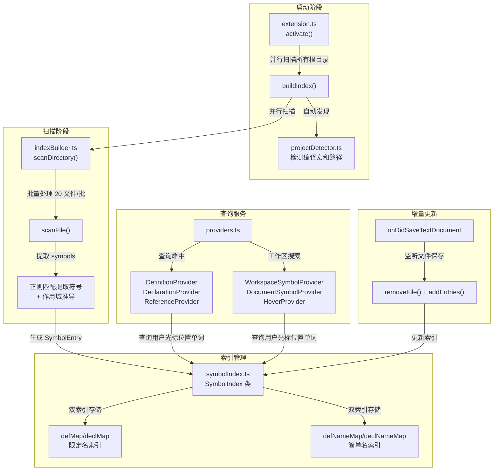
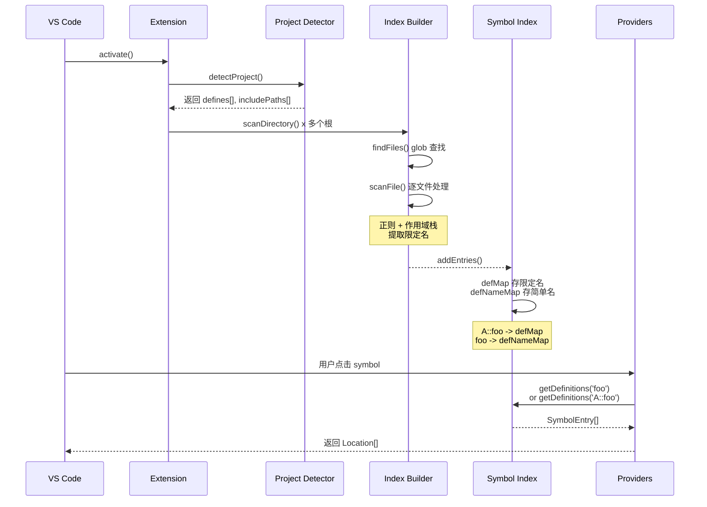

# C/C++ Navigator 架构设计

## 模块架构图

## 数据流流程图

## 模块职责表

| 模块 | 职责 | 核心逻辑 |
|------|------|--------|
| **extension.ts** | 生命周期管理 | 激活 → 后台索引 + 注册 6 个 Provider + 监听文件变更 |
| **projectDetector.ts** | 编译环境检测 | 读取 `compile_commands.json` / `CMakeCache.txt` / `.config` 提取宏 |
| **indexBuilder.ts** | 文件扫描解析 | 正则匹配 + 条件编译分析 + 作用域栈推导 → 生成限定名 |
| **symbolIndex.ts** | 内存索引存储 | 4 个 Map：`defMap`/`declMap`（限定名）+ `defNameMap`/`declNameMap`（简单名）|
| **providers.ts** | 语言服务 | 6 个 VSCode Provider：定义、声明、引用、工作区搜索、大纲、悬停 |
| **types.ts** | 数据结构 | `SymbolEntry` 包含 `name` + `qualifiedName` + 位置 + 宏条件 |

## 核心优化点

1. **后台索引**：激活时立即注册 Provider，索引在后台构建
2. **并行扫描**：多根目录并行扫描，单目录内文件按 20 为单位批量处理
3. **双重索引**：同时支持 `foo` 和 `A::foo` 查询
4. **增量更新**：文件保存时只重新扫描该文件
5. **作用域追踪**：通过大括号嵌套深度推导 `namespace::class::function`
6. **条件编译**：支持 `#ifdef` / `#ifndef` / `#elif` / `#else` 嵌套分析
7. **宏拼接**：正则支持 `##` 操作符识别宏生成的标识符
