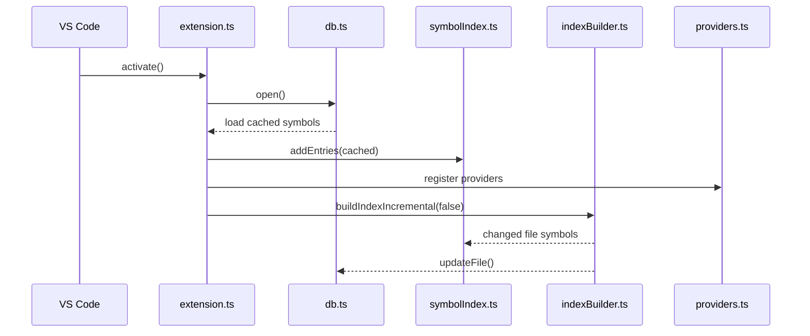
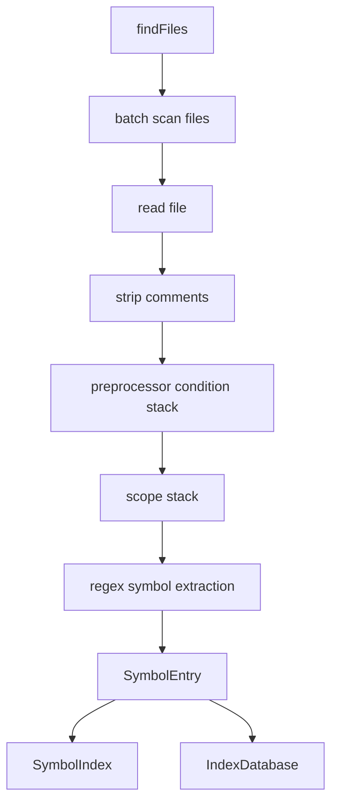

# C/C++ Navigator 架构设计

本文描述当前实现的主要模块、数据流和扩展点。项目目标是用轻量索引和可选外部数据库，为大型 C/C++ 工程提供快速代码浏览能力。

## 总体结构

```text
VS Code Extension Host
        |
        v
src/extension.ts
        |
        +-- projectDetector.ts
        +-- indexBuilder.ts
        +-- symbolIndex.ts
        +-- db.ts
        +-- providers.ts
        +-- cscopeBackend.ts
        +-- callHierarchyProvider.ts
        +-- historyManager.ts
```

## 模块职责

| 模块 | 职责 |
| --- | --- |
| `extension.ts` | 插件生命周期、配置读取、命令注册、Provider 注册、状态栏、文件事件监听 |
| `projectDetector.ts` | 从 `compile_commands.json`、`CMakeCache.txt`、`.config` 提取宏和 include 信息 |
| `indexBuilder.ts` | 扫描 C/C++ 文件，移除注释，处理简单条件编译，提取符号 |
| `symbolIndex.ts` | 内存索引，按简单名和限定名存储定义/声明 |
| `db.ts` | 持久化索引，优先 SQLite，失败时降级 JSON |
| `providers.ts` | Definition、Declaration、Reference、Workspace Symbol、Document Symbol、Hover |
| `cscopeBackend.ts` | 构建/查询 `cscope.out`、构建/查询 `tags` |
| `callHierarchyProvider.ts` | 基于 cscope 查询调用层级 |
| `historyManager.ts` | 浏览历史 Tree View 和持久化 |
| `types.ts` | 共享数据结构 |

## 启动流程



启动时会先加载缓存索引，然后立刻注册 VS Code Provider。后台增量扫描会更新变化文件，因此插件可以较快进入可用状态。

## 索引数据结构

核心结构定义在 `types.ts`：

```ts
export interface SymbolEntry {
    name: string;
    qualifiedName: string;
    kind: 'definition' | 'declaration';
    uri: string;
    line: number;
    character: number;
    ifdefStack: string[];
}
```

`SymbolIndex` 维护四个 Map：

| Map | Key | Value |
| --- | --- | --- |
| `defMap` | `qualifiedName` | 定义列表 |
| `defNameMap` | `name` | 定义列表 |
| `declMap` | `qualifiedName` | 声明列表 |
| `declNameMap` | `name` | 声明列表 |

这样可以同时支持：

- `foo` 这样的简单名查询
- `ns::Class::foo` 这样的限定名查询

## 内置索引流程



内置索引器的设计取舍：

- 用文本扫描换取速度和低资源占用。
- 使用作用域栈推导 `namespace::class::symbol`。
- 使用条件栈过滤明显不活跃的代码分支。
- 不做完整 AST、类型系统、宏展开和模板实例化。

## 持久化策略

`IndexDatabase` 有两种工作模式：

1. SQLite 模式：如果 `better-sqlite3` 可加载，则写入 `symbol-index.db`。
2. JSON 模式：如果 SQLite 原生模块不可用，则写入 `symbol-index.json`。

这种设计是为了降低 Windows 和远程开发环境中的安装阻力。`better-sqlite3` 是可选依赖，即使原生模块构建失败，插件也仍可工作。

## 外部数据库后端

`CscopeBackend` 当前支持：

- 检测 `cscope` / `ctags` 是否可用。
- 生成 `cscope.files`。
- 构建 `cscope.out`。
- 构建 `tags`。
- 使用 `cscope -L` 查询定义、引用、调用者和被调用者。
- 当 cscope 查不到定义时，从 `tags` 文件 fallback 查询定义。

后续可扩展：

- `readtags` 精确查询。
- GNU Global / gtags 后端。
- 数据库路径配置。
- 使用内置可执行文件。

## VS Code Provider 映射

| VS Code 能力 | 实现 |
| --- | --- |
| DefinitionProvider | `DefinitionProvider` / `CscopeDefinitionProvider` |
| DeclarationProvider | `DeclarationProvider` |
| ReferenceProvider | `ReferenceProvider` / `CscopeReferenceProvider` |
| WorkspaceSymbolProvider | `WorkspaceSymbolProvider` |
| DocumentSymbolProvider | `DocumentSymbolProvider` |
| HoverProvider | `HoverProvider` |
| CallHierarchyProvider | `CallHierarchyProvider` |
| TreeDataProvider | `HistoryManager` |

## 文件事件

| 事件 | 行为 |
| --- | --- |
| 保存 C/C++ 文件 | 重新扫描该文件，替换 DB 和内存索引中的旧符号 |
| 删除文件 | 从 DB 和内存索引中删除该文件符号 |
| 配置变化 | 触发后台增量索引 |

## 命令流

| 命令 | 主要调用 |
| --- | --- |
| `cppNavigator.rebuildIndex` | `buildIndexIncremental(true)` |
| `cppNavigator.buildCscopeDb` | `CscopeBackend.buildCscope()` + `buildCtags()` |
| `cppNavigator.rebuildAll` | 外部数据库构建 + 内置索引构建 |
| `cppNavigator.searchSymbol` | `SymbolIndex.search()` + QuickPick |
| `cppNavigator.previewDefinition` | `SymbolIndex.getDefinitions()` + Webview |
| `cppNavigator.searchSelectedText` | VS Code `workbench.action.findInFiles` |

## 当前边界

该架构刻意不追求完整 C/C++ 语义分析。对于复杂跳转准确性，优先通过 cscope、ctags、未来的 gtags/readtags 后端增强；内置索引保留为快速、低依赖、低资源的基础能力。
