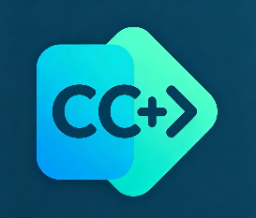

# C/C++ Navigator

[](https://github.com/Kalaser/cpp-navigator/actions/workflows/build.yml)
[](https://opensource.org/licenses/MIT)

C/C++ Navigator 是一个面向大型 C/C++ 代码库的 VS Code 导航插件。它优先提供轻量、快速、可增量更新的代码跳转能力，并可结合 `cscope` / `ctags` 数据库增强定义、引用和调用层级查询。

> 💡 **设计哲学**：用文本扫描换取速度和低资源占用，不做完整 AST 解析。适合快速浏览代码结构，而非替代完整语言服务器。



## ✨ 核心特性

| 特性 | 说明 |
|------|------|
| 🚀 **快速索引** | 增量扫描 C/C++ 文件，启动后快速进入可用状态 |
| 🔍 **多后端支持** | 自动检测 cscope 数据库，或仅用内置索引 |
| 💾 **持久化存储** | 优先 SQLite 数据库，失败时自动降级 JSON 缓存 |
| 📜 **浏览历史** | 自动记录跳转历史，支持 Tree View 回溯 |
| 🛠️ **灵活配置** | 支持额外源码根目录、排除模式、活跃宏定义 |

## 📋 功能清单

### 代码导航能力

| 功能 | 快捷键 | 状态 | 说明 |
|------|--------|------|------|
| **跳转定义** | `F12` / `Ctrl+Click` | ✅ | 支持函数、宏、结构体、类、变量 |
| **跳转声明** | `Alt+F12` | ✅ | 跳转到头文件中的声明 |
| **查找引用** | `Shift+F12` | ✅ | cscope 后端优先，内置模式扫描文本 |
| **工作区符号** | `Ctrl+T` | ✅ | 全局符号搜索，支持模糊匹配 |
| **文件大纲** | `Ctrl+Shift+O` | ✅ | 当前文件的符号树 |
| **Hover 提示** | 鼠标悬停 | ✅ | 显示定义位置和代码片段 |
| **定义预览** | 右键菜单 | ✅ | 旁侧 Webview 预览定义 |
| **调用层级** | - | ✅ | cscope 后端支持 Incoming/Outgoing calls |

### 数据库构建

| 功能 | 状态 | 说明 |
|------|------|------|
| **内置索引构建** | ✅ | 扫描工作区 C/C++ 文件，提取符号 |
| **cscope 数据库** | ✅ | 生成 `cscope.files` 和 `cscope.out` |
| **ctags 数据库** | ✅ | 生成 `tags` 文件，作为 fallback |
| **一键重建全部** | ✅ | 同时构建外部数据库和内置索引 |

### 浏览历史

| 功能 | 状态 | 说明 |
|------|------|------|
| **历史记录** | ✅ | 自动记录定义跳转、引用搜索、符号搜索 |
| **Tree View 展示** | ✅ | Explorer 中的 `C/C++ Browse History` 视图 |
| **持久化存储** | ✅ | 历史数据跨会话保存 |
| **清空历史** | ✅ | 一键清空所有历史记录 |

## 🚀 快速开始

### 安装

从 [GitHub Releases](https://github.com/Kalaser/cpp-navigator/releases) 下载 `.vsix` 文件：

```bash
# 在 VS Code 中安装
code --install-extension cpp-navigator-1.0.1.vsix
```

或在 VS Code 扩展面板选择「从 VSIX 安装」。

### 编译安装

```bash
git clone https://github.com/Kalaser/cpp-navigator.git
cd cpp-navigator
npm install
npm run compile
npm run package
```

### 调试扩展

1. 打开本仓库
2. 运行 `npm run compile`
3. 按 `F5` 启动 Extension Development Host
4. 在新窗口打开一个 C/C++ 项目
5. 执行 `C/C++ Navigator: Rebuild Index (incremental)`

## 📖 常用命令

| 命令 | 用途 | 快捷键/入口 |
|------|------|-------------|
| `C/C++ Navigator: Rebuild Index (incremental)` | 增量重建内置索引 | 命令面板 |
| `C/C++ Navigator: Build cscope/ctags Database` | 构建外部数据库 | 命令面板 |
| `C/C++ Navigator: Rebuild All (cscope + index)` | 构建全部数据库 | 命令面板 |
| `C/C++ Navigator: Show Index Stats` | 显示索引统计 | 命令面板 |
| `C/C++ Navigator: Search Symbol` | 全局符号搜索并跳转 | 命令面板 |
| `C/C++ Navigator: Preview Definition` | 旁侧预览定义 | 右键菜单 |
| `C/C++ Navigator: Search Selected Text` | 全局搜索选中文本 | 右键菜单 |
| `C/C++ Navigator: Clear Browse History` | 清空浏览历史 | 视图标题栏 |

## ⚙️ 配置项

在 `settings.json` 中配置：

```json
{
  // 后端选择：auto(自动检测) / cscope(强制) / builtin(仅内置)
  "cppNavigator.backend": "auto",
  
  // cscope 可执行文件路径
  "cppNavigator.cscopeCmd": "cscope",
  
  // ctags 可执行文件路径
  "cppNavigator.ctagsCmd": "ctags",
  
  // 活跃宏定义（用于 #ifdef 过滤）
  "cppNavigator.activeConfigs": ["CONFIG_DEBUG", "ENABLE_FEATURE"],
  
  // 额外源码根目录
  "cppNavigator.extraRoots": ["/path/to/sdk", "../vendor"],
  
  // 排除模式
  "cppNavigator.excludePatterns": [
    "**/build/**",
    "**/out/**",
    "**/.git/**",
    "**/node_modules/**",
    "**/CMakeFiles/**",
    "**/vendor/**/test/**"
  ]
}
```

### 配置说明

| 配置 | 默认值 | 说明 |
|------|--------|------|
| `cppNavigator.backend` | `auto` | `auto`: 自动检测 cscope；`cscope`: 强制使用；`builtin`: 仅内置索引 |
| `cppNavigator.cscopeCmd` | `cscope` | cscope 可执行文件路径，可填绝对路径 |
| `cppNavigator.ctagsCmd` | `ctags` | ctags 可执行文件路径 |
| `cppNavigator.activeConfigs` | `[]` | 内置索引处理 `#ifdef` 时认为启用的宏 |
| `cppNavigator.extraRoots` | `[]` | 除工作区外额外扫描的源码根目录 |
| `cppNavigator.excludePatterns` | 见上方 | Glob 排除模式，支持 `**` 通配符 |

## 🔧 后端模式对比

### 内置索引模式

**优点**：
- ✅ 无需外部依赖，开箱即用
- ✅ 增量更新，文件保存时自动刷新
- ✅ 支持简单 `#ifdef` 过滤
- ✅ 低资源占用，适合大型代码库

**局限**：
- ⚠️ 文本级扫描，非完整 AST 解析
- ⚠️ 复杂模板、宏展开可能不准
- ⚠️ 函数指针调用、重载解析有限

**适合场景**：快速浏览、轻量导航、资源受限环境

### cscope / ctags 后端

**优点**：
- ✅ 语义级查询，准确性高
- ✅ 支持调用层级（Caller/Callee）
- ✅ 成熟的工业级工具��

**要求**：
- 需要手动构建数据库
- 需要安装 `cscope` 和 `ctags`

**构建命令**：
```bash
# 在项目根目录执行
cscope -Rcbqk
ctags -R -f tags .
```

**适合场景**：对准确性要求高、需要调用层级分析

## 📊 索引统计

执行 `C/C++ Navigator: Show Index Stats` 查看：

```
Indexed Files: 1,234
Total Symbols: 45,678
  - Definitions: 23,456
  - Declarations: 22,222
Database: SQLite (symbol-index.db)
Backend: auto (cscope detected)
```

## 📁 项目结构

```
cpp-navigator/
├── src/
│   ├── extension.ts           # 入口：生命周期、命令注册
│   ├── indexBuilder.ts        # 索引构建器
│   ├── symbolIndex.ts         # 内存索引
│   ├── db.ts                  # 持久化（SQLite/JSON）
│   ├── providers.ts           # VS Code Provider 实现
│   ├── cscopeBackend.ts       # cscope/ctags 后端
│   ├── callHierarchyProvider.ts # 调用层级
│   ├── historyManager.ts      # 浏览历史
│   ├── projectDetector.ts     # 项目配置检测
│   └── types.ts               # 类型定义
├── images/
│   └── icon.png
├── docs/
│   ├── ARCHITECTURE.md        # 架构设计
│   ├── DEVELOPMENT.md         # 开发指南
│   └── ROADMAP.md             # 路线图
└── package.json
```

## 🛠️ 开发脚本

```bash
npm install          # 安装依赖
npm run compile      # 编译 TypeScript
npm run watch        # 监听模式
npm run package      # 打包 VSIX
npm run test         # 运行测试（待实现）
```

## 📚 文档

- [🏗️ 架构设计](ARCHITECTURE.md) - 模块划分、数据流、扩展点
- [🔧 开发指南](docs/DEVELOPMENT.md) - 本地开发、调试、测试
- [🗺️ 路线图](docs/ROADMAP.md) - 功能规划、待办事项

## ⚠️ 已知限制

| 限制 | 影响 |  workaround |
|------|------|-------------|
| 内置引用搜索是文本扫描 | 可能包含注释、字符串中的同名符号 | 使用 cscope 后端提高准确性 |
| 复杂模板/宏展开 | 定义可能遗漏或错误 | 结合 cscope/ctags 后端 |
| 函数指针调用 | 可能无法精确定位 | 手动查找或使用全局搜索 |
| 非活跃代码分支 | 默认不索引 | 配置 `activeConfigs` 调整 |

## 🆚 与完整语言服务器对比

| 能力 | C/C++ Navigator | clangd / cpptools |
|------|-----------------|-------------------|
| 跳转定义 | ✅ | ✅ |
| 跳转声明 | ✅ | ✅ |
| 查找引用 | ✅ (文本/cscope) | ✅ (语义级) |
| 智能补全 | ❌ | ✅ |
| 错误诊断 | ❌ | ✅ |
| 重构 | ❌ | ✅ |
| 资源占用 | 🟢 低 | 🔴 高 |
| 启动速度 | 🟢 快 | 🟡 慢 |
| 部署难度 | 🟢 简单 | 🟡 需配置编译数据库 |

## 🤝 贡献

欢迎提交 Issue 和 Pull Request！

```bash
# Fork 仓库
git clone https://github.com/YOUR_USERNAME/cpp-navigator.git
cd cpp-navigator

# 创建功能分支
git checkout -b feature/your-feature

# 开发并提交
npm run compile
git commit -m "feat: add your feature"

# 推送 PR
git push origin feature/your-feature
```

## 📄 许可证

[MIT License](LICENSE)

## 🙏 致谢

- 灵感来源于 [SourceSeek](https://github.com/sourcegraph/sourcegraph)
- 使用 [better-sqlite3](https://github.com/WiseLibs/better-sqlite3) 提供 SQLite 支持
- 打包工具 [@vscode/vsce](https://github.com/microsoft/vscode-vsce)
